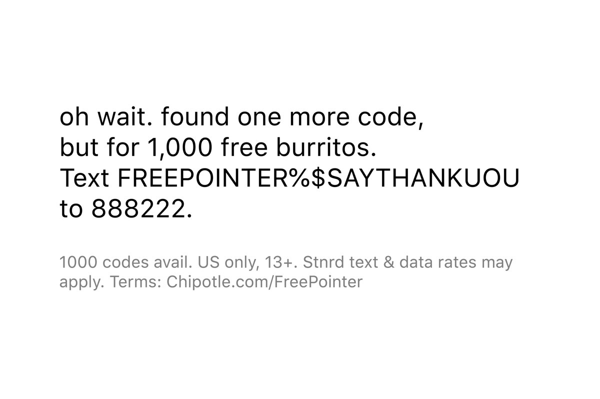
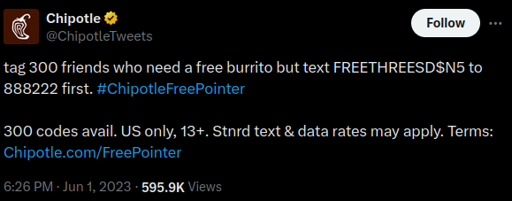
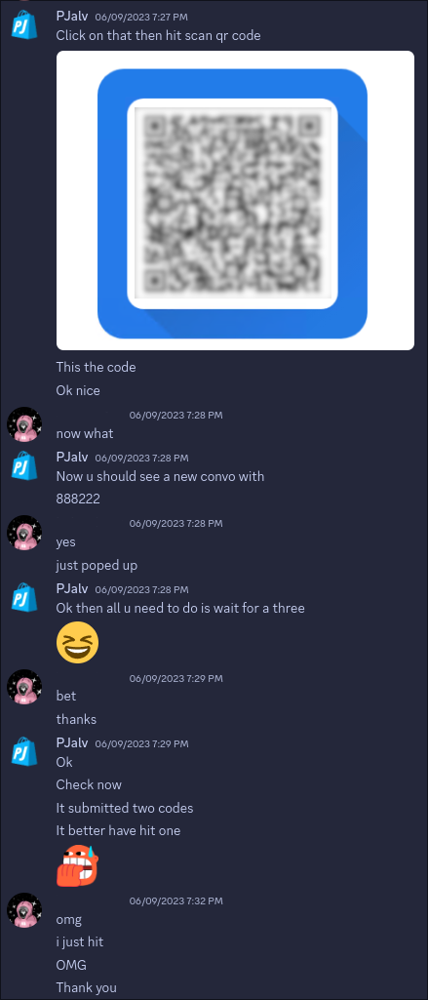

# Chipotle Code Redemption Bot

## Disclaimer

**This code is no longer working due to changes in the Twitter API after the transition to X and its new API.**

## Descriptions

The Chipotle Code Redemption Bot is an automated system designed to monitor the Chipotle Twitter account for promotional codes. This was used for the 2023 NBA Finals, where Chipotle ran an event where for every 3-pointer scored, they would release a redeemable code on their Twitter (X) account. The code was limited to 300 uses. This bot aimed to automate the entire process and could even adapt to image posts using OCR. 

The bot parses both text and images in the tweets to extract these codes and sends them via SMS using an unofficial Messages by Google client library. Additionally, it posts the tweets onto a Discord webhook using the `discord.js` library.

Messages by Google fork by PJalv: [https://github.com/PJalv/messages-web/tree/flow](https://github.com/PJalv/messages-web/tree/flow)

## Features

- **Twitter Monitoring**: Continuously monitors the Chipotle Twitter account for new posts.
- **Text and Image Parsing**: Extracts promotional codes from both text and images in the tweets.
- **SMS Delivery**: Sends the extracted codes via SMS using an unofficial Messages by Google client library.
- **Discord Integration**: Posts the tweets onto a Discord webhook using the `discord.js` library.

## Images

### Tweets from Chipotle Account

  
  

### Testimonial via Discord

